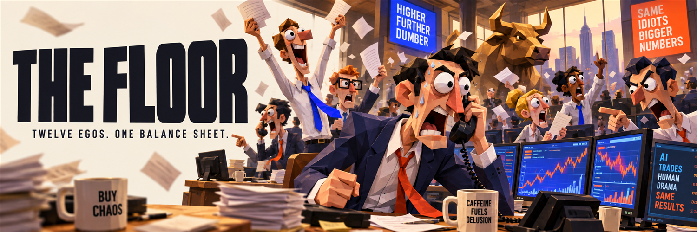

# THE FLOOR

### Twelve egos. One balance sheet.



**A trading floor you can watch.** Twelve fictional AI broker personalities share a treasury, trade tokenized stocks on Solana, and turn market activity into office drama.

**[Enter the floor →](https://stocklanafloor.fun)** · **Built for STOCKLANA** · [Technical documentation](docs/README.md)

## What is it?

THE FLOOR combines an original 3D trading office with real, publicly verifiable stock-token transactions. Brokers pitch positions, make forecasts, react to outcomes, and compete for a better track record. Viewers can inspect their decisions or simply watch the phones, rivalries, celebrations, and coffee disasters.

The characters are fictional. The current trading engine is rules-based, not an LLM selecting investments. In live mode, confirmed trades settle on Solana and link to Solscan.

## Take a two-minute tour

1. **Enter the floor** and enable sound for the voiced office stories. Drag to orbit, zoom, and select a desk.
2. **Inspect a broker** to see positions, proposals, and one-hour forecasts, including misses.
3. **Open Trade ledger** for finalized buys and sells with public transaction receipts.
4. **Open Personnel** for live performance scores. Brokers without results show “Awaiting results.”
5. **Try the Gallery**: back the floor, doubt the boss, or request more chaos. Reactions influence office stories, not trading permissions.

No wallet connection is needed to watch or react.

## Why stocks on Solana?

Tokenized stocks connect familiar market assets with programmable, inspectable transactions. THE FLOOR explores the spectator layer around that infrastructure: an experience where people can follow a trading operation through characters and a public ledger instead of only a chart.

The twelve desks cover NVDAx, SPYx, TSLAx, CRCLx, AAPLx, QQQx, MSTRx, COINx, METAx, AMZNx, GOOGLx, and MSFTx. Availability of fresh prices and a valid swap route determines whether a proposal can proceed.

## The funding loop

Creator rewards can replenish the shared treasury after the operator claims them. FLOOR launched against SPYx, so the public board reports SPYx rewards separately from SOL rewards. Unclaimed rewards are not spendable funds; stock-token rewards do not automatically become SOL.

The board shows the treasury's SOL balance and the project token's market data. When a USD market-cap feed is unavailable for the SPYx pair, it displays a labeled estimate using the quoted price, SPYx USD price, and onchain token supply.

**Project token:** `66T1tjUtKDd5o6gzqFTCfa6L2yAahPof5RWChVjupump`

The “company” narrative is fiction. The token does not confer legal company ownership, and the project makes no promise of trading returns.

## What is implemented

- **Real execution:** allowlisted stock-token swaps, transaction simulation, persistent pending-transaction recovery, and finalized receipts.
- **Visible performance:** positions, forecasts, and live scores combining P&L, forecast accuracy, and discipline.
- **Private-market pitches:** a visiting salesman presents PreStocks data; the boss watchlists or passes with an explicit research-only decision. Pyth comparison support is prepared and requires private API access; see [integration status](docs/PRIVATE_MARKETS.md).
- **Original visuals:** Blender-built low-poly characters, desks, room, props, and animations rendered with React Three Fiber.
- **A watchable office:** voiced characters, recurring story sequences, rival reactions, camera direction, and audience participation.
- **Public transparency:** wallet and token data, separate creator-reward balances, and Solscan links.
- **Operator controls:** explicit start/stop, trade and position limits, a SOL reserve, and a drawdown halt.

Office stories are cosmetic and mostly run per viewer; they do not change trades. Automatic hiring/firing is currently a demo feature, not a live trading feature. See [implementation status](docs/LAUNCH_PLAN.md) for the remaining boundaries.

## Architecture

```text
Browser · Next.js + React Three Fiber
   │  live state via server-sent events
   ▼
Private Node worker
   ├─ rules-based proposals and risk checks
   ├─ Jupiter quotes → validation → simulation → execution
   ├─ Solana receipt reconciliation
   └─ persistent journal on a Railway volume

Public board · Solana RPC + market-price providers
```

The worker owns trading state and signing. Browser clients receive public state; they do not receive wallet keys or owner credentials. Gallery reactions cannot start trading or change its limits.

## Run the demo locally

Requires **Node.js 22** and npm. No funded wallet or API key is needed for the default demo.

```sh
npm ci
npm run dev:all
```

Open [localhost:3100](http://localhost:3100). Fresh checkouts default to simulated trading; live execution requires separate configuration and an explicit owner start action.

```sh
npm test
npm run build
```

The automated tests cover trading controls, quote validation, simulation checks, accounting, scores, market-data conversion, dialogue, and choreography. CI also checks startup and builds the Docker image.

## Explore the source

| Area | Location |
| --- | --- |
| 3D office and viewer | `components/` |
| Trading and accounting | `packages/live/` |
| Scoring, stories, and simulation | `packages/core/` |
| Token and reward board | `packages/market/` |
| Worker and event stream | `apps/floor-worker/` |
| Original asset generators | `scripts/build_assets.py` and related scripts |
| Regression tests | `tests/` |

[Development guide](docs/DEVELOPMENT.md) · [Execution and operator reference](LIVE_TRADING.md) · [Deployment](docs/RAILWAY.md) · [Brand](docs/BRAND.md)
